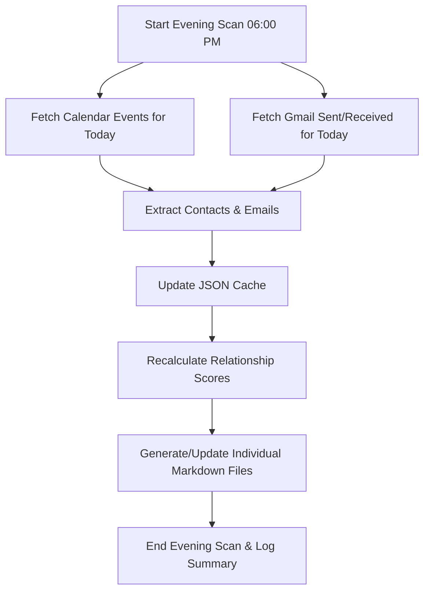

# Personal CRM Skill Architecture & Design

The Personal CRM skill is a high-freedom, scheduled system designed to manage personal and professional relationships. It automates contact discovery, relationship scoring, interaction logging, and follow-up recommendations by integrating with **Gmail**, **Google Calendar**, and generating **individual Markdown files** under `/home/ubuntu/contacts/{sanitized_name}.md`.

---

## 1. Data Model & Storage

The CRM uses a two-tier storage model:

1.  **JSON Cache (`/home/ubuntu/personal_crm.json`)**: Machine-readable JSON object used as the primary fast storage and source of truth.
2.  **Markdown Profiles (`/home/ubuntu/contacts/*.md`)**: Human-readable, beautiful individual Markdown files updated automatically after every scan.

### Contacts Fields (JSON)
*   `name`: Full name of the contact.
*   `email`: Email address (primary key).
*   `company`: Current organization.
*   `role`: Job title.
*   `relationship_score`: Calculated dynamically (0-10) based on warmth and frequency.
*   `last_interacted`: ISO date string of the last email or calendar event.
*   `interaction_source`: `Gmail`, `Calendar`, or `Manual`.
*   `status`: `Active`, `Warm`, `Cold`, or `Do Not Contact`.
*   `interaction_log`: Chronological list of interaction logs (date, type, note, key_takeaways).

---

## 2. Dynamic Relationship Scoring (0-10)

The CRM automatically scores relationships to prioritize weekly follow-ups:

| Score | Tier | Description | Frequency Rule |
| :--- | :--- | :--- | :--- |
| **8-10** | **Tier 1 (VIP / Active)** | Strategic partners, active clients, close colleagues. | Follow up every **14 days** |
| **5-7** | **Tier 2 (Warm / Regular)** | General network, past clients, casual industry peers. | Follow up every **30-60 days** |
| **1-4** | **Tier 3 (Cold / Inactive)** | New introductions, old classmates, low-frequency contacts. | Follow up every **90-180 days** |

---

## 3. Daily Evening Scan Workflow (06:00 PM)

The daily scan runs every evening to parse interactions from the day and update the local JSON cache and individual contact profiles.

### Steps:
1.  **Fetch Today's Data**:
    *   Call `google_calendar_search_events` for today's range.
    *   Call `gmail_search_messages` with `after:{today_date}`.
2.  **Extract Entities**:
    *   Parse meeting attendees (excluding the user's own email).
    *   Parse email senders and recipients.
3.  **Update JSON Cache**:
    *   Read existing cache, update `last_interacted`, `interaction_source`, and insert new logs.
4.  **Recalculate & Render**:
    *   Recalculate scores and statuses for all contacts.
    *   Sanitize each contact's name to generate a safe filename (e.g. `John Doe` -> `/home/ubuntu/contacts/john_doe.md`).
    *   Write/update each contact's profile file with a Key Info table and a full chronological Interaction History table (columns: Date, Channel, Summary / Notes, Key Takeaways).

---

## 4. Weekly Recommendation Workflow (Monday 09:00 AM)

The weekly routine analyzes the local CRM cache to suggest people to catch up with.

### Algorithm:
1.  **Query Cache**: Fetch all contacts with status `Active` or `Warm` from the local JSON cache.
2.  **Calculate Overdue**:
    *   Compare `last_interacted` + `Frequency Rule` (based on Score) against the current date.
    *   If `Current Date` > `last_interacted` + `Frequency Rule`, mark as **Overdue**.
3.  **Generate Recommendations**:
    *   Select the top 5 contacts with the highest overdue gap.
    *   For each contact, generate a **suggested context** for follow-up.
4.  **Present Weekly Report**:
    *   Output a clean report with the top 5 recommendations and draft emails.
